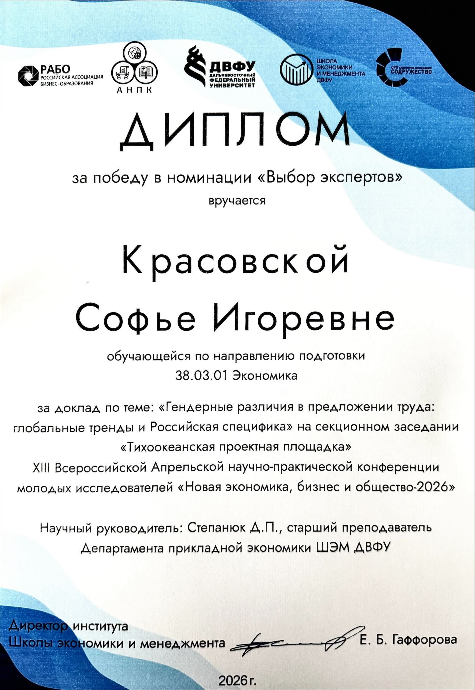
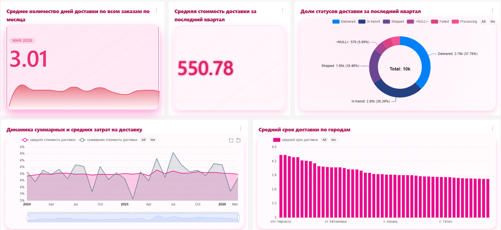
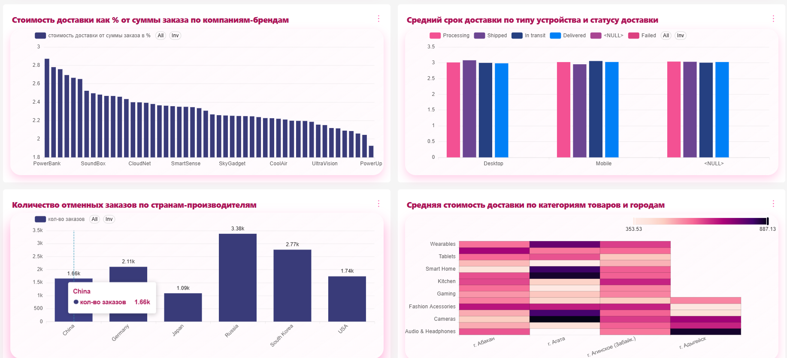

## Other-achievements-projects
### 1) Всероссийская Апрельская научно-практическая конференция молодых исследователей "Новая экономика, бизнес и общество-2026
Доклад победил в номинации "Выбор экспертов" 

  

### 2) Аналитический дашборд в Apache SuperSet
Анализ был посвящен логистическим процессам и данным в компании (исходные данные смоделированы)

### 3) Защита итогового проекта по итогам обучения на программе Цифровые кафедры по модулю "Управление цифровой франсформацией" 
Итоговый проект представлял собой решение кейса по визуализации с помощью BI инструментов дефектов и аномалий в данных из предоставленной базы данных. В результате был построен дашборд в PowerBI, который демонстировал логические ошибки в данных

