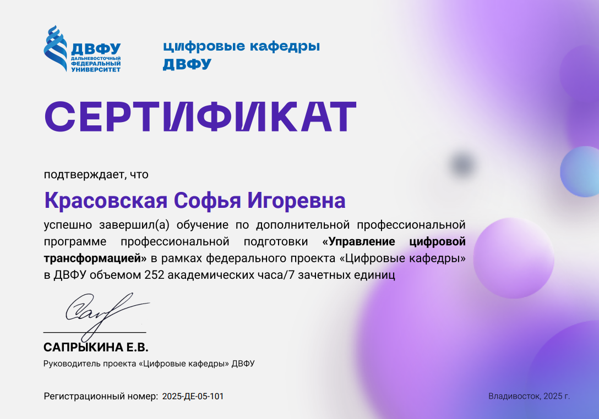
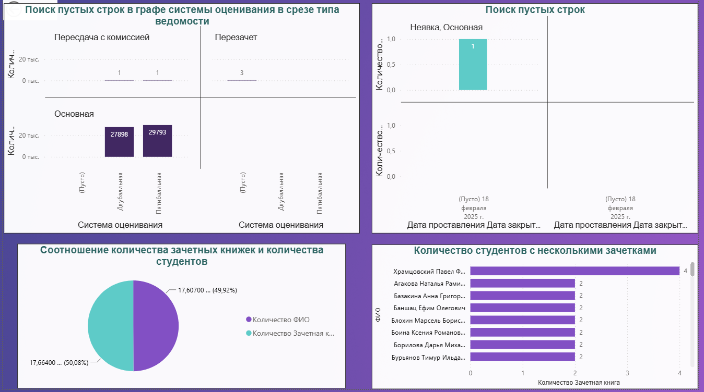
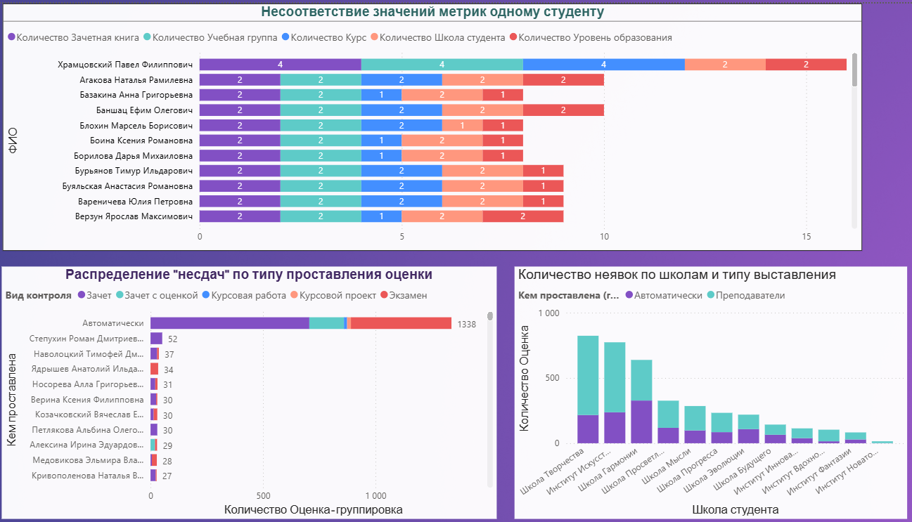

## Other-achievements-projects
### 1) XIII Всероссийская Апрельская научно-практическая конференция молодых исследователей "Новая экономика, бизнес и общество-2026
Представленный на конференции доклад победил в номинации "Выбор экспертов" 

  

### 2) Сертификат об окончании ДПО по федеральному проекту "Цифровые кафедры"

  

### 3) Аналитический дашборд в Apache SuperSet
Анализ был посвящен логистическим процессам и данным в компании (исходные данные смоделированы). 

### 4) Защита итогового проекта по итогам обучения на программе Цифровые кафедры по модулю "Управление цифровой франсформацией" 
Итоговый проект представлял собой решение кейса по визуализации с помощью BI инструментов для поиска и демонстрации дефектов и аномалий в данных из предоставленной базы данных. В результате был построен дашборд в PowerBI, который демонстировал логические ошибки в данных

Ниже две страницы из проекта:

